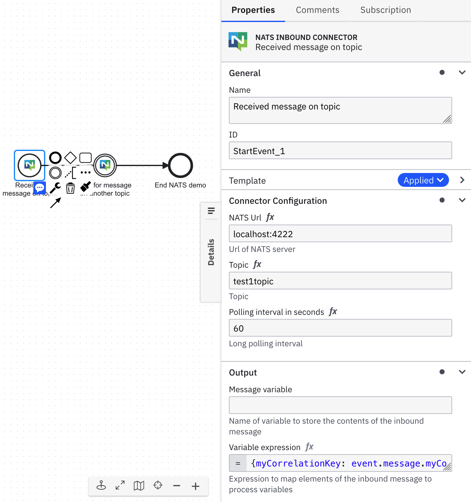

[](https://github.com/camunda-community-hub/community)
[](https://github.com/Camunda-Community-Hub/community/blob/main/extension-lifecycle.md#proof-of-concept-)


# Inbound NATS Connector Template

!!! Work in progress !!!

A starting point to build a Start and Intermediate Inbound NATS Connector. Send messages to topics on NATS and have process instances start or catch intermediate events. Feedback and PRs are welcome! In the Connector you'll need to provide the URL of the NATS server, the topic to listen to, and the long polling interval in seconds.

There are three outputs and can be accessed from the ```event``` object:
```event.url```,
```event.topic```,
```event.message```

In most cases you'll be interested in ```event.message```. If the message is sent in a JSON string you'll be able to access data within the object using dot notation.



For intermediate catch events you need to set a correlation key in the process using a variable and send the correlation key in the payload as part of the incoming message

## Build

You can package the Connector by running the following command:

```bash
mvn clean package
```

This will create the following artifacts:

- A thin JAR without dependencies.
- An uber JAR containing all dependencies, potentially shaded to avoid classpath conflicts. This will not include the SDK artifacts since those are in scope `provided` and will be brought along by the respective Connector Runtime executing the Connector.

### Shading dependencies

You can use the `maven-shade-plugin` defined in the [Maven configuration](./pom.xml) to relocate common dependencies
that are used in other Connectors and the [Connector Runtime](https://github.com/camunda-community-hub/spring-zeebe/tree/master/connector-runtime#building-connector-runtime-bundles).
This helps to avoid classpath conflicts when the Connector is executed. 

Use the `relocations` configuration in the Maven Shade plugin to define the dependencies that should be shaded.
The [Maven Shade documentation](https://maven.apache.org/plugins/maven-shade-plugin/examples/class-relocation.html) 
provides more details on relocations.

## API

### Connector Properties

This Connector can be configured with the following properties:

| Name                                                     | Description                                    | Example                               |
|----------------------------------------------------------|------------------------------------------------|---------------------------------------|
| NATS URL                                                 | URL of NATS Server                             | `localhost:4222`                      |
| Topic                                                    | Topic on NATS Server to monitor                | `sampleTopic`                         |
| Polling interval                                         | Long polling interval in seconds               | `60`                                  |
| Correlation key (process) - for intermediate catch event | Process variable to correlate incoming message | `processCorrelationKey`               |
| Correlation key (payload) - for intermediate catch event | Correlation key in incoming message            | `event.message.messageCorrelationKey` |
| Activation condition      - for intermediate catch event | Condition under which the Connector triggers   | `event.message.aVariable = 'ok'`      |

### Output

This Connector produces the following output:

```json
{
  "event": {
    "url": "localhost:4222",
    "topic": "sampleTopic",
    "message": "some message"
  }
}
```

## Test locally

Run unit tests

```bash
mvn clean verify
```

### Test with local runtime

Use the [Camunda Connector Runtime](https://github.com/camunda-community-hub/spring-zeebe/tree/master/connector-runtime#building-connector-runtime-bundles) to run your function as a local Java application.

In your IDE you can also simply navigate to the `LocalContainerRuntime` class in test scope and run it via your IDE.
If necessary, you can adjust `application.properties` in test scope.

## Element Template

The element templates can be found in the [element-templates/inbound-template-connector.json](element-templates/nats-start-connector.json) file.
